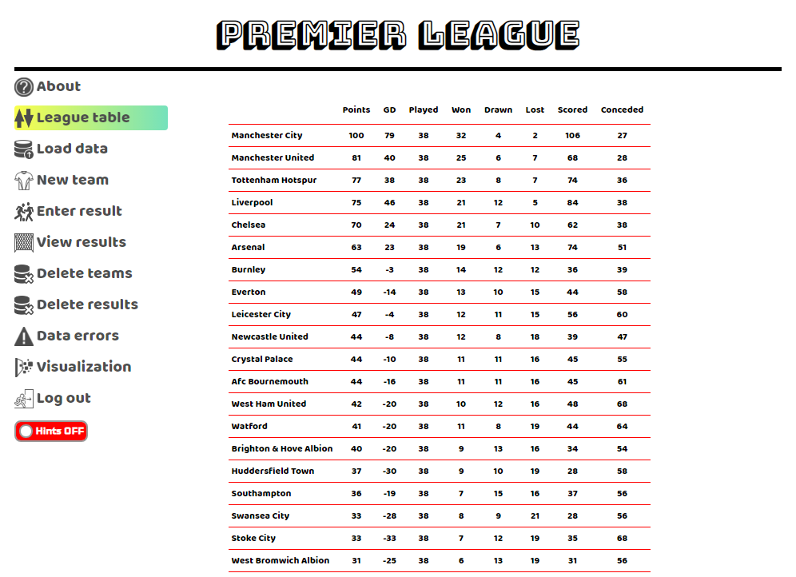
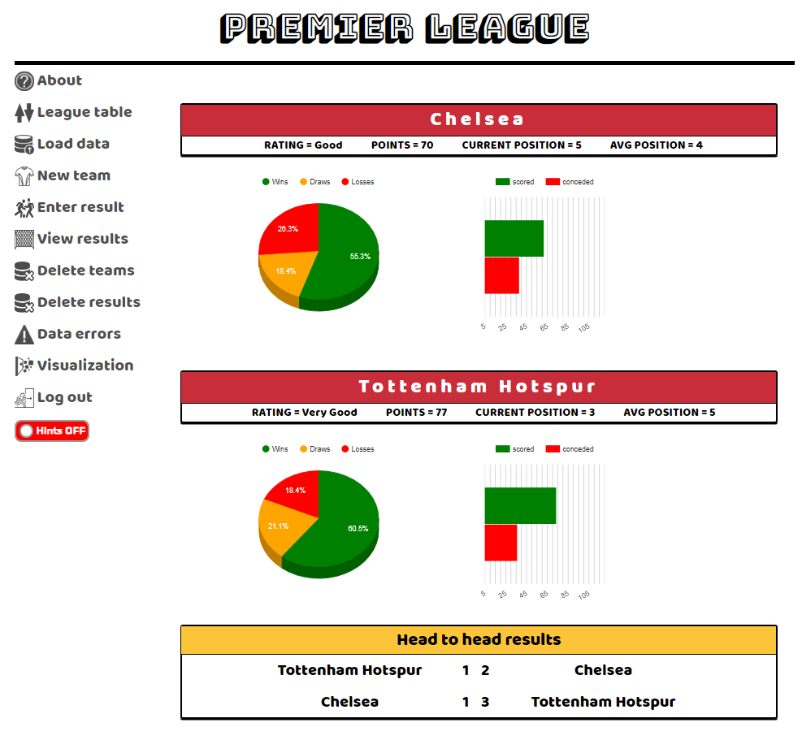

# Football League Web Application Demo
This project demonstrates software design and development skills I have acquired with a view to changing careers from a business analyst to a developer role.  

The application creates and manages data related to football results and includes graphical visualisation of key statistics.  
Functions implemented include those you would find in any business application:
* Creation of data through UI forms or bulk data uploads
* Validation to confirm data conforms to domain/business rules
* Identifying and flagging errors to system users providing feedback on how to resolve data issues
* Data dashboards providing visualisation of key metrics related to a team’s performance.  

## Pre-requisites
* An installation of Python
## Setting up and running application
After you’ve downloaded the source code it’s worth [creating a virtual environment](https://uoa-eresearch.github.io/eresearch-cookbook/recipe/2014/11/26/python-virtual-env/) to keep a separation between python libraries you may have installed locally and the ones used by this application.  
Once virtual environment is activated from the command line run:  
* pip install flask
* pip install peewee  
   
To start the application:  
* python main_app.py

# Usecases
The main workflows are:
* The creation and management of Team and Result data
* Running data visualisations
* Resolving data errors identified by the system

## The creation and management of Team and Result data
Data can be entered in two ways:
* One record at a time using UI forms accessed by the 'New team' and 'Enter results' menu options
* Uploaded in bulk using the 'Load data' menu option
  * In order to demonstrate the data validation features when loading results data there is an option to select a file that deliberately contains errors
  * The bulk uploads use CSV files in the background, feel free to edit them with teams and results from any league aside from English Premier League. The 2017Results csv contains 7 columns, the first 2 (HomeTeam and AwayTeam) are self-explanatory, the other 5 need some explaining:
    * FTHome - represents the number of goals scored by the home team by full-time
    * FTAway - represents the number of goals scored by the away team by full-time
    * HTHome - represents the number of goals scored by the home team by half-time
    * HTAway - represents the number of goals scored by the away team by half-time
    * Week - represents the week of the season the game took place in
    
### Editing results
It maybe a result gets entered incorrectly (hey, humans always make mistakes), not a problem! Using the 'View results' menu option a result can be edited. When a result is edited notice how the statistics (seen by clicking on the 'League table' menu) are updated - this updating of the league table in response to results being added, updated and deleted forms part of the core logic of the system.

### Deleting teams and results
Once data is created it can be deleted using the menu options 'Delete teams' and 'Delete results'. These 2 are all or nothing actions, deleting teams wipes all teams __and__ results from the system (it's not logical for results to exist without teams!) and deleting results wipes all results (but leaves teams intact).  
However retrieving data is easy - just use 'Load data' option to load it back in!  
Another less drastic delete option is available in 'View results' where choosing to edit a result provides a delete option that only acts on that one specific result.

## Running data visualisations
Using the 'Visualization' menu option a number of charts can be invoked showing information not obvious from viewing the league table:
* Bar chart showing the number of points achieved by each team and the maximum they could achieve 
* Bar chart showing the games won, drawn and lost for each team
* Line chart showing the trend for each team based on their position in the league table over the weeks

__For each of these charts it is possible to choose a subset of the teams so only data for those teams selected is presented.__    
Additionally any two teams can be compared using the 'Compare Performance' function which shows key performance metrics for 2 teams side by side.  
To see the performance of a particular team simply click on the team name to see facts for that team.

## Resolving data errors identified by the system
If the results file (which contains deliberate errors) was loaded the errors can be viewed through menu option 'Data errors'. This view explains (to the end-user) the nature of the error and provides 2 actions:
* The option to resolve errors (fixing them)
* The option to delete errors (and be rid of them)

# Hints
On all pages there is a 'Hints' switch which can be turned on or off - my thinking behind this was it would be nice to have the system to be helpful to end-users as they view the demo! 
